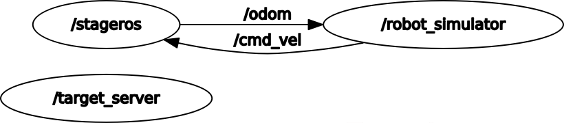

# robot_control
## OverView

This is the package to control a holonomic robot in a 2d space with a simple 2d simulator, Stage.

The robot's behavior:

1. The robot asks for a random target, with both coordinates in the interval (-6.0, 6.0).
2.  Check whether the robot reaches the target or not. 
   - If true, Go to step 1. 
   - If not, Go to step 3. 
3.  Send the velocity depending on the distance between the target and current position of the robot.
   Go to 2.


### Description of the content of the package

#### Nodes

- robot_simulator
  - Client  of the '/random_target'
  - Publisher of '/cmd_vel'
  - Subscriber of 'odom'
- target_server
  - Server of '/random_target'
- stageros
  - Publisher of 'odom'
  - Subscriber of 'cmd_vel'
  - and so on.
  - 

#### Topic 

- /cmd_vel
  - Type: gemetry_msgs/Twist
  - Publisher : /robot_simulator
  - Subscriber: /stage_ros
- /odom
  - Type: nav_msgs/Odometry
  - Publisher : /stage_ros
  - Subscriber:/robot_simulator


#### Service

- /random_target
  - Node :target_server
  - Type : robot_control/RandomPos
  - Args: min, max


#### custom service

-  robot_control/RandomPos

  - request

    - float32 min
    - float32 max

  - response

    - float32 x
    - float32 y


#### Computational graph of the system

- robot simulator
  - subscribe /odom from node "stageros", and depending on the current position, decide the velocity and publish it as /cmd_vel
  - When the robot reach the goal, this node send the service to the node "target_server"and receive the robot new target position.
- target_server
  - "target_server" get service from "robot_simulator" and send this node the new target position. 





#### 

## Installation

### Dependencies

This software is built on the Robotic Operating System ([ROS]), which needs to be install first and create the workspace. 

- Ros Kinetic


### Building

This package use the package "stage_ros".

In order to install this,

```
sudo apt-get install ros-<your_ros_version>-stage-ros
```


Install this package and the other necessary package into your workspace.

 Compile the package using ROS.

```
cd catkin_workspace/src
git clone https://github.com/n-shintaro/robot_control.git
git clone https://github.com/CarmineD8/assignment1.git
cd ../
catkin_make
rospack profile
```


## Usage

```
roscore &
```

This package requires controlling a holonomic robot in a 2d space with a simple 2d simulator, Stage. The simulator can be launched by executing the command.

```
rosrun stage_ros stageros $(rospack find assignment1)/world/exercise.world
```


To run the node (robot_simulator),

```
rosrun robot_control robot_simulator.py
```


To run the node (target_server),

```
rosrun robot_control target_server.py
```
